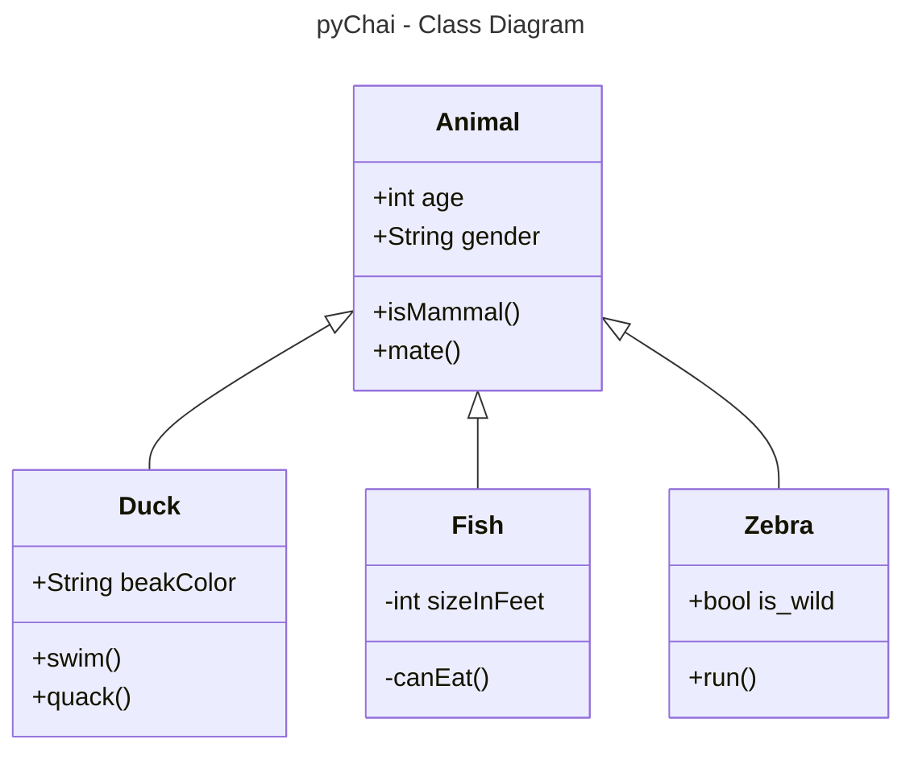
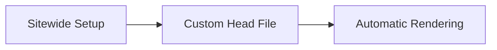

# pyChai - Parameter Mapper

### About me

Namaste! Myself Smit Bangare. I am a licensed Architect working in BIM industry. I have 2 years of experience. 

***
### Inspiration

<!-- In my initial working phase as a Junior BIM Architect, I was basically working as a draftsman, doing 3D modelling and shop drawings. I was doing manual work of data entry, populating schedules by typing and copy-pasting from MS Excel. I was becoming lazy doing this repeated work. While working, I was noting down the ways and ideas of automating certain "tedious" tasks. In between, I had the idea of automating the data entry of values from Excel to Revit Schedule. I was also upskilling myself, learning Python after office-hours. And then with the limited Python knowledge, I created a script which will fill the schedule from Excel file. The script was good enough at that time.

After a passage of time, I learnt that we can design our own plugin UI using WPF. At that time, I was hoping that I could create a customizable UI using Claude and ChatGPT. But during the process, with my limited knowledge, I was livid and frustrated at the same time. Most of the code was working, but at the same time, debugging process took huge amount of time. I remember it took 1 day just to correct a part of code.  -->

At the end, I quit. 

