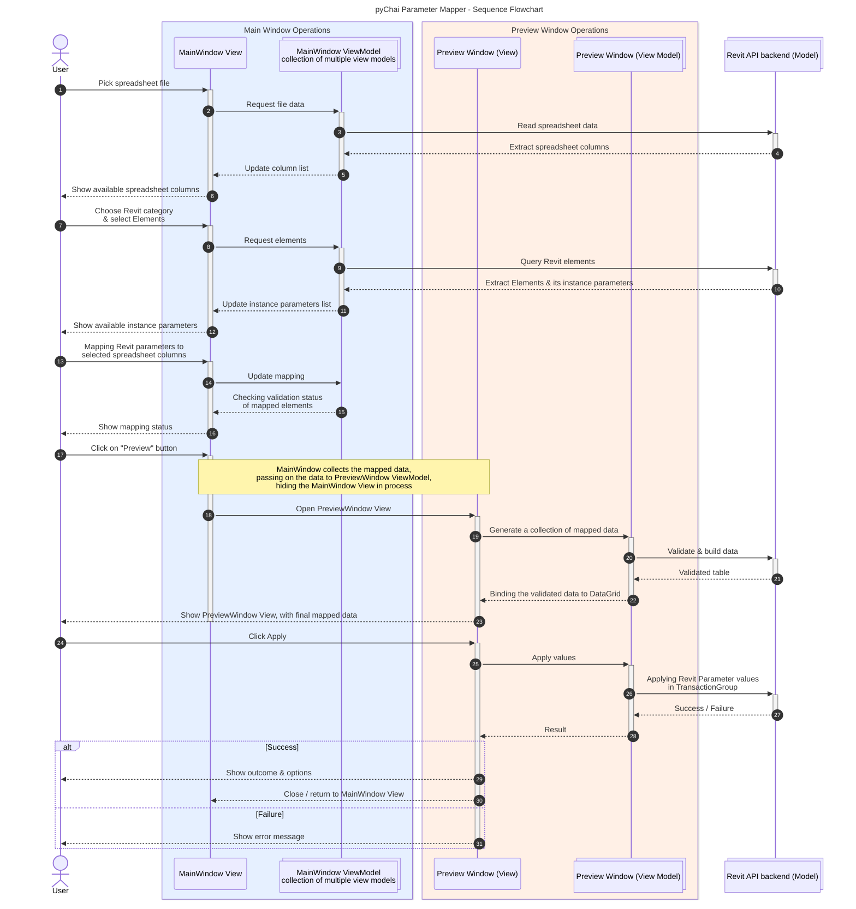

## Introduction

The blog is a personal reflection of my journey during the development of plugin, from ideation to final form of Parameter Mapper tool. 

| Name           | Parameter Mapper                                                                                      |
| -------------- | ----------------------------------------------------------------------------------------------------- |
| **Gist**       | Apply instance parameter values on Revit elements from spreadsheet (Excel/LibreOffice Calc/CSV) file. |
| **Support**    | Revit 2020 till Revit 2027                                                                            |
| **Install**    | [**Click here**](https://github.com/smit-8462/pyChai#install) for install instructions.               |
| **Additional** | Have a peek at the [**notes**](#notes) section for correct functioning of tool.                       |


---
## Background

2 years ago, I was working as a Junior BIM Architect in my previous firm. The requirement for the project I was working on involved data entry and validation of COBIE data from an Excel file provided by the client. We had to manually fill all the data from the given Excel file into the Revit model, which took me 3 days. It was a mundane and tiring task.  
  
I had just started exploring pyRevit and its shipped extensions, and I was disappointed that no ready-made script or solution existed. I tried using ChatGPT, but it was not a productive use of my time. I spent 2-3 hours debugging, which was exhausting (and my lack of Python fundamentals made it more frustrating). I also tried using Dynamo, but I failed. Eventually, I had to do the work manually.  
  
This ignited a spark in me to learn Python properly, focusing on fundamentals (and not relying on ChatGPT for help). I started making a list of tasks that required some form of automation on my part.  
  
So, after a year, I observed a trend in my firm: almost every project required some form of data filling, either filling the door schedule or populating room parameters. This was a perfect opportunity for me to make a Python script.

---
## Brainstorm

{: .light }
{: .dark }
_Image 01 - Initial sketch idea of `Parameter Mapper` tool_

The brainstorming of my initial idea spiraled into the sketch seen above. Since I already had a _rather unsuccessful attempt_ at learning C#, I didn't want to drain my learnings of Object-Orientated Programming. Therefore, the project's base was decided to be IronPython 2.7 and WPF with MVVM implementation.

---
## Development

### Tech stack

The development of **pyChai** plugin involved following tools -

| Tool                                 | Purpose                               |
| ------------------------------------ | ------------------------------------- |
| WPF                                  | Framework for plugin UI               |
| Python                               | Primary language for plugin full stack |
| Git                                  | Version Control System                |
| Adobe Illustrator                    | Icon Design                           |
| Figma                                | Initial sketch to mockup prototype    |
| Obsidian                             | Markdown-based documentation          |
| Visual Studio 2022 Community Edition | IDE for WPF XAML                      |
| pyCharm                              | IDE for Python                        |
| Mermaid.js                           | Diagram and flowchart creation        |
| Procreate                            | Brainstorming ideas                   |


### Icon design

<div align="center">
  <div style="display: inline-block; margin: 0 15px; text-align: center;">
    
    <br>
    <em>Image 02 - pyChai logo</em>
  </div>
  <div style="display: inline-block; margin: 0 15px; text-align: center;">
    
    <br>
    <em>Image 03 - Parameter Mapper logo</em>
  </div>
  <div style="display: inline-block; margin: 0 15px; text-align: center;">
    
    <br>
    <em>Image 04 - Parameter Mapper logo (Wireframe sketch)</em>
  </div>
</div>

Chai is a way of life in India. Chai tea _(pardon the "tea tea" redundancy !😶‍🌫️)_ is a warm, sweet drink made from black tea, milk, water, and fragrant spices. I love **Chai** !🍵, naturally the inspiration behind the name of extension along with **pyChai** logo. The logo represents a glass cup filled with Chai, showing the smoky aroma ascending from it.

The inspiration behind the "Parameter Mapper" tool's logo is the connection of nodes, similar to Dynamo/Grasshopper.

### Color palette

{: w="300" }
_Image 05 - Kulhad Chai_
The Chai in a Kulhad (an earthy clay cup) was chosen as a base for color palette, radiating a warmth in colors.


_Image 06 - Color palette_


### Initial Prototype


_Image 07 - Translating sketch to WPF prototype_

The initial form-building of sketch to a working prototype of WPF XAML filled me with ecstasy. But somewhere in my vision, it left a lot to be desired.

So, I started looking for WPF-based UI design inspiration. On the way, I stumbled upon the [WPF UI](https://github.com/lepoco/wpfui), a fluent modern WPF library. When I saw that [ricaun](https://github.com/ricaun) (whom I have been following from past year), it reinvigorated my feeling of taking deep-dive in the code base. I am glad I studied the codebase; I learned more about WPF, UI styling, code organization, the MVVM approach and some magical things using code-behind, especially window maximize/restore.

---
## Final Product


_Video 01 - Parameter Mapper : Showcase video of tool_


_Image 08 - Parameter Mapper : Main Window_


_Image 09 - Parameter Mapper : Drop-down selection_


_Image 10 - Parameter Mapper : Mapping Revit instance parameters with spreadsheet columns_


_Image 11 - Parameter Mapper : An Excel file with a header row_


_Image 12 - Parameter Mapper : Preview Window showing preview of mapped elements with values_


_Image 13 - Parameter Mapper : Preview Window when data-validation error_


_Image 14 - Parameter Mapper : Report showing the summary and errors (if found)_


_Image 15 - Parameter Mapper : Dialog box shown post completion_

---
## Notes

> Here, spreadsheet file is either of these - **Excel / LibreOffice Calc / CSV**
{: .prompt-tip }

> IMPORTANT
> 
> - The selected row in "Sorting" column will be used as a reference for identifying elements.
> - The spreadsheet file should have only one header row, with unique column header name, else it will show with suffix `.1` added (doesn't affect the tool).
> - The spreadsheet file should have only 1 work sheet inside the file.
> - The Revit project's units will be considered when implementing numerical values from spreadsheet file.
> - The numerical values must be in digits only, not strings. Example, `2' 6"` will give error, `2.5`(feet decimal) is valid.
> - The elements inside group will be ignored.
{: .prompt-info }

---
## Visual Diagram

> To expand image, click on "Zoom" icon on top-right part of image.
{: .prompt-tip }

### Class diagram

```mermaid
---
title: pyChai - Class Diagram
config:
  layout: elk
  theme: custom
---
classDiagram
    %% Main script
    namespace Main_script {
    class Main {
        <<main entry point>>
        + main()
        }
    }

    %% ---------------------------------------
    %% Views
    class MainWindow {
        +vm_windowBottomBar : WindowBottomBarViewModel
        +vm_mainWindow : MainWindowViewModel
        +usercontrol_manager : UserControlManager
        +theme_manager : ThemeManager
        +ext_event_handler : BasicExEventHandler

        +ButtonEvent_Window_Minimize()
        +ButtonEvent_Window_Resize()
        +ButtonEvent_Window_Close()
        +ButtonEvent_Window_Theme()
        +ButtonEvent_Window_VisitProfile()
        +ButtonEvent_Main_Clear()
        +ButtonEvent_Main_PickFile()
        +ButtonEvent_Main_RefreshContent()
        +ButtonEvent_Main_SelectManual()
        +ButtonEvent_Main_SelectAll()
        +ButtonEvent_Main_SelectClear()
        +ButtonEvent_Main_ShowError()
        +ButtonEvent_Main_PreviewContent()
        +ButtonEvent_Main_Cancel()
        +OnMainWindowClosing()
        -_select_elements()
        -_clear_main_things()
        -_clear_all_things()
        -_generate_preview_content()
    }

    class PreviewWindow {
        -_main_window : MainWindow
        -_main_vm : MainWindowViewModel
        +vm_windowBottomBar : WindowBottomBarViewModel
        +vm_previewWindow : PreviewWindowViewModel
        -_cell_validity_converter : CellValidityConverter
        -_row_sibling_error_converter : CellValidityConverter
        -_validation_tooltip_converter : ValidationToTooltipConverter
        +usercontrol_manager : UserControlManager
        +theme_manager : ThemeManager

        +ButtonEvent_Window_Minimize()
        +ButtonEvent_Window_Resize()
        +ButtonEvent_Window_Close()
        +ButtonEvent_Window_Theme()
        +ButtonEvent_Window_VisitProfile()
        +ButtonEvent_Preview_GoBack()
        +ButtonEvent_Preview_Apply()
        +ButtonEvent_Preview_Cancel()
        +OnAutoGeneratingColumn()
        +pakka_apply_values()
        -_on_apply_complete()
    }

    class WindowBottomBarUC {
        +WebsiteEvent : RoutedEvent$    %% Class-level attribute / static attribute

        +add_WebsiteVisit(handler)
        +remove_WebsiteVisit(handler)
        +RaiseWebsiteVisitEvent()
    }

    class WindowTopBarUC {
        +CloseEvent : RoutedEvent$
        +MinimizeEvent : RoutedEvent$
        +ResizeEvent : RoutedEvent$
        +ThemeEvent : RoutedEvent$
        +Title : str    %% Making changes in code-behind

        +add_WindowClose(handler)
        +remove_WindowClose(handler)
        +add_WindowMinimize(handler)
        +remove_WindowMinimize(handler)
        +add_WindowResize(handler)
        +remove_WindowResize(handler)
        +add_WindowTheme(handler)
        +remove_WindowTheme(handler)
        +RaiseWindowCloseEvent()
        +RaiseWindowMinimizeEvent()
        +RaiseWindowResizeEvent()
        +RaiseWindowThemeEvent()
    }

    %% ---------------------------------------
    %% ViewModels
    class WindowBottomBarViewModel {
        -_model : WebsiteModel
        
        +visit_website()
    }

    class WindowBase {
        +WM_SYSCOMMAND : int$
        +SC_MAXIMIZE : int$
        +SC_RESTORE : int$
        +SC_MINIMIZE : int$

        +is_fullscreen : bool
        -_is_toggling : bool
        -_old_top : float
        -_old_left : float
        -_old_width : float
        -_old_height : float

        -_on_loaded()
        -_get_handle() IntPtr
        -_wnd_proc() IntPtr
        +center_on_revit_monitor()
        -_get_monitor_work_area()$
        +on_maximize_restore()
        +on_minimize()
        -_on_state_changed()
        -_get_current_monitor_work_area()
        +toggle_fullscreen()
        +minimize_window()
        +close_window()
    }

    class PreviewWindowViewModel {
        -_choices_vm : ChoicesViewModel_MainWindow
        -_element_selection_vm : ElementSelection_MainWindow
        -_datagrid_column_headers : ObservableCollection~str~
        -_datagrid_rows_data : ObservableCollection~str~
        -_sorted_rows_shared : list
        -_excel_dict_transposed_shared : dict
        -_mapped_sorting_parameter_with_elements_dict_shared : dict
        +m_ExternalEvent : ExternalEvent
        +m_ExternalEventHandler : BasicExEventHandler

        +IsApplyButtonVisible : bool
        +DataViewDataTable : DataTable
        +CellValidityMap : Dictionary~str, bool~
        +CellErrorMap : Dictionary~str, str~
        +RowSiblingErrorMap : Dictionary~str, bool~
        +ErrorTextBoxDataFill : str     %% Returns a joined string, not list of string
        +HasErrors : bool

        +preview_data_generate()
        -_prepare_data()
        +apply_generated_values()
        +OnClosing()
        +finally_apply_values()
    }

    namespace Main_Window_ViewModel {
        class MainWindowViewModel {
            +FileSelection : FileSelection_MainWindow
            +CategorySelection : CategorySelection_MainWindow
            +ElementSelection : ElementSelection_MainWindow
            +ChoicesVM : ChoicesViewModel_MainWindow

            +PreviewWindowVMProperty : PreviewWindowViewModel

            +markdown_output()
        }

        class FileSelection_MainWindow {
            +SelectedFilePath : str
            +SelectedFileText : str
            +SelectedFileExtension : str
        }

        class CategoryItem {
            +CatName : str
            +CatBuiltinCat : BuiltInCategory

            +ToString() str
        }

        class CategorySelection_MainWindow {
            -_on_changed : callable
            +category_dict : list
            +category_items : ObservableCollection~CategoryItem~

            +CategoryItems : ObservableCollection~CategoryItem~
            +SelectedCategory : CategoryItem
            +SelectedBuiltInCategory : BuiltInCategory

            +set_on_changed(callback_function)
        }

        class ElementSelection_MainWindow {
            -_category_selection : CategorySelection_MainWindow
            +element_list : list~Element~

            +HasPreviewWindowOpened : bool
            +SelectedBuiltInCategory : BuiltInCategory
            +ElementsTotal : int
            +ElementsSuccess : int
            +ElementsFailed : int
            +SelectedElements : list~Element~
            +ElementsSkipped : int
            +ElementsErrorsValidated : int

            +select_elements_all()
            +select_elements_manual()
        }
    }

    namespace Choices_ViewModel {
        class ChoiceRow {
            +SerialNumber : int
            +PrimarySort : bool
            +ParameterType : str
            +RevitParameterValue : str
            +ExcelColumnValue : str
            +ParameterStorageType : StorageType
            +ParameterID : int
            +ParameterObject : Parameter
            +ParameterDefinitionForgeType : ForgeTypeId
            +ParameterValueUnitType : ForgeTypeId
            +ParameterTypeIdentifyObjectStore : ForgeTypeId
        }

        class ChoiceRowViewModel {
            -_parent_view_model : ChoicesViewModel_MainWindow
            +SerialNumber : int
            +PrimarySort : bool
            +ParameterType : str
            +RevitParameterValue : str
            +ExcelColumnValue : str
            +ParameterStorageType : StorageType
            +ParameterID : int
            +ParameterObject : Parameter
            +ParameterDefinitionForgeType : ForgeTypeId
            +ParameterValueUnitType : ForgeTypeId
            +ParameterTypeIdentifyObjectStore : ForgeTypeId
            +HasError : bool
            +ErrorMessages : str
            +ErrorTooltip : str
            +IsFilled : bool
            +ShowErrorIcon : enum
            +ShowCorrectIcon : enum
        }

        class ChoicesViewModel_MainWindow {
            -_category_selection : CategorySelection_MainWindow
            -_element_selection : ElementSelection_MainWindow
            -_file_selection : FileSelection_MainWindow
            -_rvt_param_list : list
            -_excel_column_list : list
            %% -_lookup_dict_params : dict
            -_data_column_headers : list
            -_data_rows : list
            -_mapping_dict : dict
            -_rvt_parameter_items : ObservableCollection~str~
            -_excel_column_items_headers : ObservableCollection~str~
            %% +_command_add_row : RelayCommand
            %% +_command_delete_row : RelayCommand
            %% -_choice_rows : ObservableCollection~ChoiceRowViewModel~

            +SelectedBuiltInCategory : BuiltInCategory
            +SelectedElementsList : list~Element~
            +FilePath : str
            +FileExtension : str
            +ChoiceRows : ObservableCollection~ChoiceRowViewModel~
            +ExcelColumnList : ObservableCollection~str~
            +InternalExcelDict : dict
            +RevitParameterList : ObservableCollection~str~
            +LookupDictParams : dict
            +CanDeleteRow : bool
            +Command_AddRow : RelayCommand
            +Command_DeleteRow : RelayCommand
            +HasPrimarySort : bool
            +HasAnyErrors : bool
            +AllRowsFilled : bool
            +IsButtonEnabled : bool

            +choices_list_setup() 
            +excel_dict_setup() 
            -_renumber_rows() 
            +AddRow() 
            +DeleteRow() 
            +reset_to_default_row_collection() 
            +ValidateDuplicates()
        }
    }

    %% ---------------------------------------
    %% MVVM
    class FileExtensionConverter {
        +Convert(value, targetType, parameter, culture) bool
        +ConvertBack(value, targetType, parameter, culture) str
    }

    class RelayCommand {
        -_execute : callable
        -_can_execute : callable
        -_handlers : list

        +add_CanExecuteChanged(handler)
        +remove_CanExecuteChanged(handler)
        +RaiseCanExecuteChanged()
        +CanExecute(parameter) bool
        +Execute(parameter)
    }

    class ViewModelBase {
        +propertyChangedEventHandler : list

        +OnPropertyChanged(property_name) 
        +add_PropertyChanged(handler) 
        +remove_PropertyChanged(handler) 
    }

    class ViewModelBaseValidation {
        +propertyChangedEventHandler : list
        +dataErrorsChangedEventHandler : list
        -_errors : dict
        
        +HasErrors : str

        +add_PropertyChanged(handler)
        +remove_PropertyChanged(handler)
        +OnPropertyChanged(property_name)
        +add_ErrorsChanged(handler)
        +remove_ErrorsChanged(handler)
        +OnErrorsChanged(property_name)
        +GetErrors(property_name) List~str~
        +AddError(property_name, error_message)
        +ClearErrors(property_name)
        +SetProperty(property_name, field_name, value)
    }

    class CellValidityConverter {
        -_get_validity_map : callable
 
        +Convert(value, targetType, parameter, culture) bool
        +ConvertBack(value, targetType, parameter, culture) bool
    }

    class ValidationToTooltipConverter {
        -error_map_provider : callable
 
        +Convert(value, targetType, parameter, culture) bool
        +ConvertBack(value, targetType, parameter, culture) bool
    }


    %% ---------------------------------------
    %% Models
    class NumpyEncoder {
        +default(obj)
    }

    class mo_cpy_fileio_pyrevit {
        <<module>>
        -_file_to_dataframe(file_path, ext) DataFrame
        -_extract_values(pandas_dataframe) dict
        -_log_failure(context, args_list)
        +main()
    }

    class mo_datatable {
        <<module>>
        +transpose_dict(existing_dictionary, mapped_columns) dict
        +valid_element_list_generator(selected_element_list, sorting_element_parameter_id) dict
    }

    class DataTableOperations {
        +datatable_operations(orted_rows, transposed_excel_dict, mapped_dict, preview_window_vm, element_selection_vm)
        -_validate_value(value, storage_type, forge_type) bool
        -_build_error_message(value, storage_type, forge_type) str
        -_build_error_line(primary_sort_col_name, row_key, col_name, value, storage_type, forge_type) str
    }

    class ElementSelecter {
        +built_in_cat : BuiltInCategory

        -_builtincategory_from_string(category_string)$ BuiltInCategory
        +select_all() list~Element~
        +elem_select_manual() list~Element~
    }

    class RevitParameterCollection {
        -_element_list : list~Element~

        -_extract_parameters_from_elements() dict
        +list_making_from_dict() tuple~list, dict~
    }

    class mo_elem_selecter {
        <<module>>
        +category_in_model_list() list
    }

    class mo_fileiops {
        <<module>>
        +load_file() str
    }

    class PySubprocess {
        +launch_pipeline_pyrevit(file_path, file_ext) dict
        -_get_script_file_location(file_name)$ str
    }

    class BasicExEventHandler {
        +passable_method : callable
        +on_complete : bool

        +Execute(UIApplication)
        +GetName() str
    }

    class ParameterApplication {
        -_sorted_rows : list~ChoiceRowViewModel~
        -_transposed_excel_dict : dict
        -_mapped_dict : dict
        -_param_tuple_list : list

        -_gather_parameter_collection()
        -_parameters_apply_old_method() bool
        +apply_parameter_values() bool
    }

    class WebsiteModel {
        +linkedin_profile : str
    }

    %% ---------------------------------------
    %% Helpers
    class PyRevitConfigs {
        +SECTION_NAME : str$
        +OPTION_NAME_01 : str$
        +OPTION_NAME_02 : str$
        +OPTION_NAME_03 : str$

        -_cpy_location : str
        -_plugin_extension_location : str

        +read_cpy_external_lib_location()
        +read_cpy_plugin_lib_location()
        +read_cpy_location()
        -_read_property(property_name, property_value) str
        -_add_property(property_name, property_value)
        +purge_all_properties()
        -_get_cpy_location_from_ipy()$ str
        -_get_extension_root_path()$ str
    }

    class he_event_manager {
        <<module_helper>>
        +get_or_register_event(name, owner_type)
    }
    
    class he_fileviewer {
        <<module_helper>>
        +shorten_path(file_path) str
    }

    class he_output_messages {
        <<module_helper>>
        +show_output_markdown_template(markdown_template_path, template_variables)
    }

    class he_resdict_manager {
        <<module_helper>>
        +add_resource_dict(target, resource_dict_list) 
    }

    class ResDictManager {
        +apply_to(target, xaml_list)
        +apply_shared(target)$
    }

    class ThemeManager {
        +window_target : Window
        +extra_targets : list
        +primary_theme_xaml : str
        +secondary_theme_xaml : str
        +uri_primary : Uri
        +uri_secondary : Uri
        +is_primary : bool
        
        -_all_targets() list~Window~
        -_uri_path() tuple~Uri, Uri~
        -_add_theme(xaml_uri) 
        -_remove_theme(xaml_uri) 
        +toggle() 
    }

    class UserControlManager {
        +window_target : Window
        -_title : str

        %% top_bar and bottom_bar are public attributes.
        %% It is accessed externally (like self.usercontrol_manager.top_bar in MainWindow).
        +top_bar : WindowTopBarUC
        +bottom_bar : WindowBottomBarUC

        -_window_top_bar_setup()
        -_window_bottom_bar_setup()
    }

    class ValidationService {
        +validate(rows)$ dict
    }

    %% ---------------------------------------
    %% .NET helpers
    class INotifyPropertyChanged {
        <<interface>>
    }

    class INotifyDataErrorInfo {
        <<interface>>
    }

    class PropertyChangedEventArgs {
        <<.NET class>>
    }

    class DataErrorsChangedEventArgs {
        <<.NET class>>
    }

    class ProcessStartInfo {
        <<.NET class>>
    }

    class Process {
        <<.NET class>>
    }

    class UserControl {
        <<.NET class>>
    }

    class RoutedEventHandler {
        <<.NET delegate type>>
    }

    class RoutedEventArgs {
        <<.NET class>>
    }

    class Window {
        <<.NET base class>>
    }

    class HwndSource {
        <<.NET class>>
    }

    class HwndSourceHook {
        <<.NET class>>
    }

    class WindowInteropHelper {
        <<.NET class>>
    }

    class WindowState {
        <<.NET enum>>
    }

    class IntPtr {
        <<.NET struct>>
    }

    class ObservableCollection {
        <<.NET generic collection>>
    }

    class Visibility {
        <<.NET enum>>
    }
    
    class List {
        <<.NET class>>
    }
    
    class EventArgs {
        <<.NET class>>
    }
    
    class IValueConverter {
        <<.NET class>>
        +Convert(value, targetType, parameter, culture) object
        +ConvertBack(value, targetType, parameter, culture) object
    }
    
    class Binding {
        <<.NET class>>
    }
    
    class UriKind {
        <<.NET enum>>
    }
    
    class Uri {
        <<.NET type>>
    }
    
    class ResourceDictionary {
        <<.NET class>>
    }
    
    class RoutingStrategy {
        <<.NET enum>>
    }
    
    class EventManager {
        <<.NET class>>
    }
    
    class ArgumentException {
        <<.NET exception>>
    }
    
    %% ---------------------------------------

    %% RELATIONSHIP
    Main ..> MainWindow : import from (dependency)

    %% Views
    MainWindow --|> WindowBase : inherits
    MainWindow *-- WindowBottomBarViewModel : composed of
    MainWindow *-- MainWindowViewModel : composed of
    MainWindow ..> ResDictManager : depends on
    MainWindow *-- ThemeManager : composed of
    MainWindow *-- UserControlManager : composed of
    MainWindow ..> he_fileviewer : uses
    MainWindow ..> mo_fileiops : uses
    MainWindow ..> FileExtensionConverter : depends on
    MainWindow ..> PreviewWindow : depends on
    %% BasicExEventHandler stored for the life of the window, and explicitly torn down 
    %% in OnMainWindowClosing, means ownership with event lifecycle.
    MainWindow *-- BasicExEventHandler : composed of ()

    PreviewWindow --|> WindowBase : inherits
    PreviewWindow *-- WindowBottomBarViewModel : composed of
    PreviewWindow *-- PreviewWindowViewModel : composed of
    PreviewWindow *-- UserControlManager : composed of
    PreviewWindow *-- ThemeManager : composed of
    PreviewWindow *-- CellValidityConverter : composed of
    PreviewWindow *-- ValidationToTooltipConverter : composed of
    PreviewWindow ..> ResDictManager : depends on
    PreviewWindow o-- MainWindow : aggregate references (passed in from outside)
    PreviewWindow o-- MainWindowViewModel : aggregate references (passed in from outside)

    WindowBottomBarUC --|> UserControl : inherits
    WindowBottomBarUC ..> ResDictManager : depends on
    WindowBottomBarUC ..> he_event_manager : depends on
    WindowBottomBarUC ..> RoutedEventHandler : depends on
    WindowBottomBarUC ..> RoutedEventArgs : depends on

    WindowTopBarUC --|> UserControl : inherits
    WindowTopBarUC ..> ResDictManager : depends on
    WindowTopBarUC ..> he_event_manager : depends on
    WindowTopBarUC ..> RoutedEventHandler : depends on
    WindowTopBarUC ..> RoutedEventArgs : depends on

    WindowBase --|> Window : inherits
    WindowBase ..> HwndSource : depends on
    WindowBase ..> HwndSourceHook : depends on
    WindowBase ..> WindowInteropHelper : depends on
    WindowBase ..> WindowState : depends on
    WindowBase ..> IntPtr : depends on
    WindowBase ..> WindowStartupLocation : depends on
    WindowBase ..> Screen : depends on
    WindowBase ..> Process : depends on

    %% -------------------------------------
    %% ViewModels
    WindowBottomBarViewModel *-- WebsiteModel : owns
    WindowBottomBarViewModel ..> ProcessStartInfo : depends on
    WindowBottomBarViewModel ..> Process : depends on

    MainWindowViewModel --|> ViewModelBase : inherits
    MainWindowViewModel *-- FileSelection_MainWindow : composed of
    MainWindowViewModel *-- CategorySelection_MainWindow : composed of
    MainWindowViewModel *-- ElementSelection_MainWindow : composed of
    MainWindowViewModel *-- ChoicesViewModel_MainWindow : composed of
    MainWindowViewModel ..> he_output_messages : depends on

    FileSelection_MainWindow --|> ViewModelBase : inherits

    CategorySelection_MainWindow --|> ViewModelBase : inherits
    CategorySelection_MainWindow *-- CategoryItem : owns (1..*)
    CategorySelection_MainWindow ..> mo_elem_selecter : depends on
    CategorySelection_MainWindow ..> ObservableCollection : depends on

    ElementSelection_MainWindow --|> ViewModelBase : inherits
    ElementSelection_MainWindow ..> CategorySelection_MainWindow : depends on
    ElementSelection_MainWindow ..> ElementSelecter : depends on

    ChoiceRowViewModel --|> ViewModelBaseValidation : inherits
    ChoiceRowViewModel o-- ChoicesViewModel_MainWindow : aggregates (shared instance)
    ChoiceRowViewModel ..> Visibility : depends on
    ChoiceRowViewModel ..> PySubprocess : depends on
    ChoiceRowViewModel ..> RevitParameterCollection : depends on
    ChoiceRowViewModel ..> ValidationService : depends on

    ChoicesViewModel_MainWindow --|> ViewModelBase : inherits
    ChoicesViewModel_MainWindow o.. CategorySelection_MainWindow : aggregates (shared instance)
    ChoicesViewModel_MainWindow o.. ElementSelection_MainWindow : aggregates (shared instance)
    ChoicesViewModel_MainWindow o.. FileSelection_MainWindow : aggregates (shared instance)
    ChoicesViewModel_MainWindow ..> ObservableCollection : depends on
    ChoicesViewModel_MainWindow ..> RelayCommand : depends on
    ChoicesViewModel_MainWindow *-- ChoiceRow : owns (1..*)
    ChoicesViewModel_MainWindow ..> RevitParameterCollection : depends on 
    ChoicesViewModel_MainWindow ..> PySubprocess : depends on

    %% PreviewWindowViewModel
    PreviewWindowViewModel --|> ViewModelBaseValidation : inherits
    PreviewWindowViewModel o-- ChoicesViewModel_MainWindow : aggregates (shared instance)
    PreviewWindowViewModel o-- ElementSelection_MainWindow : aggregates (shared instance)
    PreviewWindowViewModel o-- BasicExEventHandler : aggregates (shared instance)
    PreviewWindowViewModel o-- ExternalEvent : aggregates (shared instance)
    PreviewWindowViewModel ..> mo_datatable : depends on
    PreviewWindowViewModel ..> DataTableOperations : depends on
    PreviewWindowViewModel ..> ParameterApplication : depends on
    PreviewWindowViewModel *-- ObservableCollection : composed of
    PreviewWindowViewModel *-- DataTable : composed of

    %% -------------------------------------
    %% MVVM
    ViewModelBase ..|> INotifyPropertyChanged : realizes/implements
    ViewModelBase ..> PropertyChangedEventArgs : depends on

    ViewModelBaseValidation ..|> INotifyPropertyChanged : realizes/implements
    ViewModelBaseValidation ..|> INotifyDataErrorInfo : realizes/implements
    ViewModelBaseValidation ..> PropertyChangedEventArgs : depends on
    ViewModelBaseValidation ..> DataErrorsChangedEventArgs : depends on
    ViewModelBaseValidation ..> List : depends on

    RelayCommand ..|> ICommand : realizes/implements
    RelayCommand ..> EventArgs : depends on

    FileExtensionConverter ..|> IValueConverter : realizes/implements
    FileExtensionConverter ..> Binding : depends on / uses

    CellValidityConverter ..|> IValueConverter : realizes/implements
    CellValidityConverter ..> DataRowView : depends on

    ValidationToTooltipConverter ..|> IValueConverter : realizes/implements
    ValidationToTooltipConverter ..> DataRowView : depends on

    %% -------------------------------------
    %% Models
    ParameterApplication ..> ChoiceRowViewModel : depends on

    BasicExEventHandler ..|> IExternalEventHandler : realizes/implements

    PySubprocess ..> subprocess_script_output_pyrevit : depends on
    PySubprocess ..> PyRevitConfigs : depends on
    PySubprocess ..> mo_cpy_fileio_pyrevit : depends on & uses script for further usage

    ElementSelecter ..> selectElement_multiple_builtincategory : depends on / uses

    DataTableOperations *-- DataTable : composed of

    mo_cpy_fileio_pyrevit ..> NumpyEncoder : uses
    NumpyEncoder --|> JSONEncoder : inherits

    %% -------------------------------------
    %% Helpers
    he_event_manager ..> RoutedEventHandler : depends on
    he_event_manager ..> RoutingStrategy : depends on
    he_event_manager ..> EventManager : depends on
    he_event_manager ..> ArgumentException : depends on

    ResDictManager ..> ResourceDictionary : depends on
    ResDictManager ..> Uri : depends on
    ResDictManager ..> UriKind : depends on

    he_resdict_manager o-- Window : aggregates (shared instance)

    ThemeManager o-- Window : aggregates (shared instance)
    ThemeManager ..> ResourceDictionary : depends on
    ThemeManager ..> Uri : depends on
    ThemeManager ..> UriKind : depends on
    
    UserControlManager o-- Window : aggregates (shared instance)
    UserControlManager *-- WindowTopBarUC : composed of
    UserControlManager *-- WindowBottomBarUC : composed of

    ValidationService ..> ChoiceRowViewModel : depends on
```
_Image 15 - Parameter Mapper : Class Diagram_

While working on the project, the code was getting increasingly complicated, making it difficult to navigate. To better understand the code and reduce the mental strain of reading the codebase later, I created a Class Diagram using Mermaid.js, taking the help of Claude for understanding the node relationships between classes. It clarified the relationships between the classes.

### Sequence Diagram


_Image 16 - Parameter Mapper : Sequence Diagram_

The above diagram shows the sequence flow of Parameter Mapper tool, from start of user interaction to the end of lifecycle of tool.

---
## Pitfalls along the development

It was not a smooth-sailing journey. There were rather many frustrating moments, where I was considering abandoning the project.
1. The architectural limitations of pyRevit meant I had to manually implement the WPF UI styles.
2. Since I was using IronPython 2.7 with WPF, the frustration of silent bugs on WPF error, and on occasion crashing without any output, unlike Revit API bugs. It gave me majority of headache !😑
3. Even though I have `UserControl`, I could not use the `Dependancy Property` in IronPython, due to flaky nature of WPF with IronPython.
4. Initially, I felt that the WPF would not be affected by changes between `.NET 4.8` and `.NET 8` _(my bad !😅)_. However, it presented inconvenience when testing and debugging between 2 different .NET versions.
5. Learning the base part in C# and implementing by translating it to IronPython is in itself a head-scratcher.
6. Implementing MVVM in IronPython 2.7-WPF workflow has been challenging in some areas. There were some situations where I had to implement code-behind solutions due to limitations of IronPython 2.7. So, it was a pure MVVM implementation as I imagined.

---
## Credits

I would like to thank the creator of pyRevit, and the team for continuously maintaining the amazing tool. Additionally, I would like to thank the following -
1. [Jean-Marc Couffin](https://github.com/jmcouffin) - For providing solutions on pyRevit forum.
2. Stack Overflow - Even though Claude can provide solution, but I found the explanations insightful and more detailed.
3. Countless blogs which I have referred for learning WPF XAML, specially data-binding and DataGrid.
4. [WPF UI](https://github.com/lepoco/wpfui) - Guiding light by reading the source WPF XAML code, along with the sample Gallery app.
5. [pyRevit](https://github.com/pyrevitlabs/pyRevit) - Learning from source code.