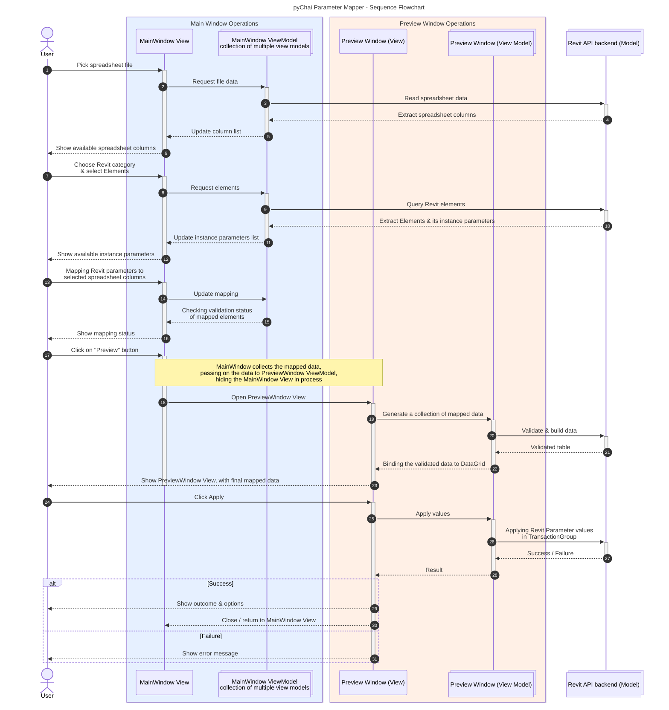

## Introduction

The blog is a personal reflection of my journey during the development of plugin, from ideation to final form of Parameter Mapper tool. 

| Name           | Parameter Mapper                                                                                      |
| -------------- | ----------------------------------------------------------------------------------------------------- |
| **Gist**       | Apply instance parameter values on Revit elements from spreadsheet (Excel/LibreOffice Calc/CSV) file. |
| **Support**    | Revit 2020 - 2027                                                                            |
| **Install**    | [**Click here**](https://github.com/smit-8462/pyChai#install) for install instructions.               |
| **Additional** | Read [**notes**](#notes) for optimal functioning of tool.                       |

  
  

  
  

---
## Backdrop

2 years ago, I was working as a Junior BIM Architect in a firm. The requirement for the project I was working on involved data entry and validation of COBIE data from an Excel file provided by the client. We had to manually fill all the data from the given Excel file into the Revit model, which took me 3 days (manual typing/copy-paste), making it a mundane and tiring task.  
  
I had just started exploring pyRevit and its shipped extensions, but disappoint hit me, that no ready-made script or solution existed. I tried using ChatGPT, but it was not a productive, wasting 2-3 hours doing empty-minded debugging, which was exhausting (and my lack of Python fundamentals made it more frustrating). I also tried using Dynamo, but I failed. Eventually, I had to do the work manually.  
  
This ignited a spark in me to learn Python properly, focusing on fundamentals (and not relying on ChatGPT for help). I started making a list of tasks that required some form of automation on my part.  
  
So, after a year, I noticed something - almost every project required some form of data-entry tasks, either filling the door schedule or populating parameters. It presented a perfect opportunity for me to make an automation script using Python. By then, I had a fairly basic idea about pyRevit and Python, thanks to [Erik Frits](https://www.youtube.com/@ErikFrits) and [Gavin Crump](https://www.youtube.com/@AussieBIMGuru).

---
## Brainstorm

{: .light }
{: .dark }
_Image 01 - Initial sketch idea of `Parameter Mapper` tool_

The brainstorming of my initial idea spiraled into the sketch seen above. My previous attempt at learning C# introduced me to OOPs concept, wanting to try implementing it using Python. Therefore, the project's base was decided to be implementation of IronPython 2.7 and WPF with MVVM architecture.

---
## Development

### Tech stack

The development of **pyChai** plugin involved following tools -

| Tool                                 | Purpose                               |
| ------------------------------------ | ------------------------------------- |
| WPF                                  | Framework for plugin UI               |
| Python                               | Primary language for plugin full stack |
| Git                                  | Version Control System                |
| Adobe Illustrator                    | Icon Design                           |
| Figma                                | Initial sketch to mockup prototype    |
| Obsidian                             | Markdown-based documentation          |
| Visual Studio 2022 Community Edition | IDE for WPF XAML                      |
| pyCharm, VSCode                      | IDE for Python                        |
| Mermaid.js                           | Diagram and flowchart creation        |
| Davinci Resolve                      | Video editor                          |

### Icon design

  

    
     
    <em>Image 02 - pyChai logo</em>
  

  

    
     
    <em>Image 03 - Parameter Mapper logo</em>
  

  

    
     
    <em>Image 04 - Parameter Mapper logo (Wireframe sketch)</em>
  

Chai is a way of life in India. Chai tea _(pardon the "tea tea" redundancy !😶‍🌫️)_ is a warm, sweet drink made from black tea, milk, water, and fragrant spices. I love **Chai** !🍵, naturally the inspiration behind the name of extension along with **pyChai** logo. The logo represents a glass cup filled with Chai, showing the smoky aroma ascending from it.

The inspiration behind the "Parameter Mapper" tool's logo is the connection of nodes, similar to Dynamo/Grasshopper.

### Color palette

{: w="300" }
_**Image 05** - Kulhad Chai_
The Chai in a Kulhad (an earthy clay cup) was chosen as a base for color palette, radiating a warmth in colors.

_**Image 06** - Color palette (light theme)_

### Initial Prototype

_**Image 07** - Translating sketch to WPF prototype_

The initial form-building of sketch to a working prototype of WPF XAML filled me with ecstasy. But somewhere in my vision, it left a lot to be desired in terms of visual appearance.

So, I started looking for WPF-based UI design inspiration. On the way, I stumbled upon the [WPF UI](https://github.com/lepoco/wpfui), a fluent modern WPF library. When I saw that [ricaun](https://github.com/ricaun) _(whom I have been lurking from past year)_, it reinvigorated my feeling of taking deep-dive in the code base. I am glad I studied the codebase; I learned more about WPF, UI styling, code organization, the MVVM approach and some magical things using code-behind, especially window maximize/restore.

---
## Final Product

  <iframe
    src="https://www.youtube.com/embed/yVqnp37yjNo"
    title="pyChai - Parameter Mapper"
    frameborder="0"
    allow="accelerometer; autoplay; clipboard-write; encrypted-media; gyroscope; picture-in-picture; web-share"
    allowfullscreen>
  </iframe>

_**Image 08** - Parameter Mapper : Main Window_

_**Image 09** - Parameter Mapper : Drop-down selection_

_**Image 10** - Parameter Mapper : Mapping Revit instance parameters with spreadsheet columns_

_**Image 11** - Parameter Mapper : An Excel file with a header row_

_**Image 12** - Parameter Mapper : Preview Window showing preview of mapped elements with values_

_**Image 13** - Parameter Mapper : Preview Window when data-validation error_

_**Image 14** - Parameter Mapper : Report showing the summary and errors (if found)_

_**Image 15** - Parameter Mapper : Dialog box shown post completion_

_**Image 16** - Parameter Mapper : Dark Mode_

---
## Notes

> Here, spreadsheet file is either of these - **Excel / LibreOffice Calc / CSV**
{: .prompt-tip }

> IMPORTANT
> 
> - The selected row in "Sorting" column will be used as a reference for identifying elements.
> - The spreadsheet file should have only one header row, with unique column header name, else it will show with suffix `.1` added (doesn't affect the tool).
> - The spreadsheet file should have only 1 work sheet inside the file.
> - The Revit project's units will be considered when implementing numerical values from spreadsheet file.
> - The numerical values must be in digits only, not strings. Example, `2' 6"` will give error, `2.5`(feet decimal) is valid.
> - The elements inside group will be ignored.
{: .prompt-info }

---
## Visual Diagram

> To expand image, click on "Zoom" icon on top-right part of image.
{: .prompt-tip }

<!--
_Image 15 - Parameter Mapper : Class Diagram_

While working on the project, the code was getting increasingly complicated, making it difficult to navigate. To better understand the code and reduce the mental strain of reading the codebase later, I created a Class Diagram using Mermaid.js, taking the help of Claude for understanding the node relationships between classes. It clarified the relationships between the classes.
-->

### Sequence Diagram

_Image 17 - Parameter Mapper : Sequence Diagram_

The Sequence Diagram shown above depicts the sequence flow of Parameter Mapper tool, from start of user interaction to the end of lifecycle of tool.

---
## Pitfalls along the development

It was not a smooth-sailing journey. There were rather many frustrating moments, where I was considering abandoning the project.
1. The architectural limitations of pyRevit meant I had to manually implement the WPF UI styles.
2. Since I was using IronPython 2.7 with WPF, the frustration of silent bugs on WPF error, and on occasion crashing without any output, unlike Revit API bugs. It gave me majority of headache !😑
3. Even though I have `UserControl`, I could not use the `Dependancy Property` in IronPython, due to flaky nature of WPF with IronPython.
4. Initially, I felt that the WPF would not be affected by changes between `.NET 4.8` and `.NET 8` _(my bad !😅)_. However, it presented inconvenience when testing and debugging between 2 different .NET versions.
5. Learning the base part in C# and implementing by translating it to IronPython is in itself a head-scratcher.
6. Implementing MVVM in IronPython 2.7-WPF workflow has been challenging in some areas. There were some situations where I had to implement code-behind solutions due to limitations of IronPython 2.7. So, it was a pure MVVM implementation as I imagined.

---
## Credits

I would like to thank the creator of pyRevit, and the team for continuously maintaining the amazing tool. Additionally, I would like to thank the following -
1. [Jean-Marc Couffin](https://github.com/jmcouffin) - For providing solutions on pyRevit forum.
2. Stack Overflow - Even though Claude can provide solution, but I found the explanations insightful and more detailed.
3. Countless blogs which I have referred for learning WPF XAML, specially data-binding and DataGrid.
4. [WPF UI](https://github.com/lepoco/wpfui) - Guiding light by reading the source WPF XAML code, along with the sample Gallery app.
5. [pyRevit](https://github.com/pyrevitlabs/pyRevit) - Learning from source code.